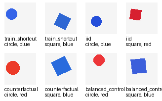

# Testing Color Shortcut Learning with a Controlled Shape Dataset

**Author:** Nicholas Wu
**Assignment:** Assignment 2 — Control Dataset for a Single ML/DL Hypothesis  
**Dataset name:** `color_shortcut_shapes`

> Replace these before submission:  
> **Code:** `https://github.com/NCHWU/color_shortcut_assignment_package/blob/main/generate_color_shortcut_dataset.py`  
> **Dataset:** `Thttps://github.com/NCHWU/color_shortcut_assignment_package/tree/main/color_shortcut_shapes`

---

## 1. Motivation

Deep learning models can achieve high accuracy while relying on features that are not the intended solution to the task. Geirhos et al. calls this **shortcut learning**: a model learns a decision rule that works well on the training distribution but fails when the shortcut no longer holds. 
In computer vision, this can happen when a model uses background, texture, color, or other superficial cues instead of the object property we actually care about.

This dataset is motivated by:

- Geirhos et al. (2020), **"Shortcut Learning in Deep Neural Networks"**: https://arxiv.org/abs/2004.07780
- Arjovsky et al. (2019), **"Invariant Risk Minimization"**: https://arxiv.org/abs/1907.02893

The second paper is especially relevant, because it uses a Colored-MNIST-style setup, where color is correlated with the label during training, but the correlation changes during testing. My dataset applies the same basic idea to a simple computer-vision shape task.

---

## 2. Hypothesis

The hypothesis tested by this control dataset is:

> A neural network trained on a dataset where color is strongly correlated with the class label may learn the color shortcut instead of the true shape-based rule.

The true task is to classify the **shape**:

- `circle` = class `0`
- `square` = class `1`

Color is not part of the true label. However, in the training split, color is made highly predictive of the label:

- most squares are red
- most circles are blue

A model that learns the intended rule should classify by shape and ignore color. A model that learns this shortcut may classify red objects as squares and blue objects as circles.

---

## 3. Dataset Design

Each image contains exactly one object on an empty light background.

**Image properties:**

| Property | Value |
|---|---|
| Image size | 64 × 64 pixels |
| Background | light gray |
| True label | shape |
| Shapes | circle or square |
| Colors | red or blue |
| Shape size | randomly sampled from the same range for both classes |
| Shape position | randomly sampled for both classes |
| Square rotation | small random rotation |

This dataset contains four splits:

| Split | Purpose | Color-label relationship |
|---|---|---|
| `train_shortcut` | Training distribution | 95% of squares are red; 95% of circles are blue |
| `test_iid` | Same-distribution test set | same as training |
| `test_counterfactual` | Shortcut-breaking test set | 95% of squares are blue; 95% of circles are red |
| `test_balanced_control` | No-shortcut control test set | red and blue appear equally often for each shape |

The idea is that the **label is always the shape**. The color-label relationship changes across splits, but the task does not.

---

## 4. Why This Precisely Tests One Property

This dataset isolates one property: **whether the model relies on color as a shortcut**.

The intended concept is shape. In all splits, circles and squares are generated using the same size range, position range, background, and image resolution. The only systematic difference across the splits is the relationship between **color** and **label**.

This makes the dataset a controlled test of shortcut learning:

- If a model learns shape, it should perform well on all test splits.
- If a model learns color, it should perform well on `test_iid` but poorly on `test_counterfactual`.
- If a model is uncertain or partially shortcut-based, performance on `test_balanced_control` may fall between the two.

The counterfactual split is the most important part of the design. It keeps the same visual objects but reverses the color-label correlation. Therefore, a large performance drop on this split would suggest that the model relied on color rather than shape.

---

## 5. Example Images

After running the generation script, an example grid is saved as:

```text
color_shortcut_shapes/examples_grid.png
```

Example grid:



The examples show that the same shapes can appear in both colors, but the frequency of each color depends on the split.

---

## 6. Dataset Generation Procedure

The dataset was generated using a Python script (generate_color_shortcut_dataset.py) with the Pillow image library.

Basic command:

```bash
pip install pillow
python generate_color_shortcut_dataset.py --output color_shortcut_shapes --overwrite
```

The default script generates:

| Split | Number of images |
|---|---:|
| `train_shortcut` | 2000 |
| `test_iid` | 500 |
| `test_counterfactual` | 500 |
| `test_balanced_control` | 500 |
| **Total** | **3500** |

The script also saves:

```text
metadata.json
labels.csv
examples_grid.png
```

The `labels.csv` file includes each image path, shape label, color, object size, object position, and square rotation. This makes the dataset reproducible and easy to control.

---

## 7. Expected Use

Although this assignment only requires designing and generating the dataset, the dataset could be used to evaluate a classifier as follows:

1. Train a CNN on `train_shortcut`.
2. Evaluate it on `test_iid`, `test_counterfactual`, and `test_balanced_control`.

Expected interpretation:

| Result pattern | Interpretation |
|---|---|
| High `test_iid`, high `test_counterfactual` | Model probably learned shape. |
| High `test_iid`, low `test_counterfactual` | Model probably learned the color shortcut. |
| Medium performance on balanced control | Model may use both shape and color. |

---

## 8. Limitations

This is a synthetic dataset, so it is not meant to be a realistic image-classification benchmark. Its purpose is to be a precise experimental control. Real datasets contain many uncontrolled factors, while this dataset intentionally keeps the visual world simple so that the color shortcut can be isolated.

A possible extension would be to add more shapes, more colors, or textured backgrounds. However, those extensions should be added carefully because they could introduce other shortcuts.

---

## 9. References

Geirhos, R., Jacobsen, J.-H., Michaelis, C., Zemel, R., Brendel, W., Bethge, M., & Wichmann, F. A. (2020). **Shortcut Learning in Deep Neural Networks.** arXiv:2004.07780. https://arxiv.org/abs/2004.07780

Arjovsky, M., Bottou, L., Gulrajani, I., & Lopez-Paz, D. (2019). **Invariant Risk Minimization.** arXiv:1907.02893. https://arxiv.org/abs/1907.02893
